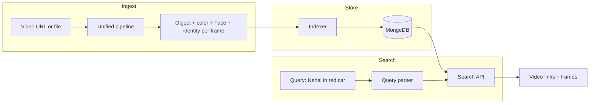

# MongoDB-Backed Search Engine for VISTA

**Storage (this repo):** Implemented. Set `MONGODB_URI` to persist detection results after each run. See `pipeline/mongodb_store.py` and the "MongoDB (optional)" section in README.

**Search engine (separate project):** To implement later. Read from the same MongoDB; implement query parsing and ranking (e.g. "Nehal in red car" → videos with both first, then by person, then by object).

---

## Current state

- **Object detection** (web + implementation): Produces per-frame detections with `class`, `color`, `label` (e.g. "red car"), `bbox`, `conf`. Stored in `pipeline/detection.py` and written to `detection_results.json` per video. Metadata (source URL, etc.) is in `metadata.txt` and in the web app's in-memory flow.
- **Face recognition**: Produces per-frame face `label` (e.g. "Nehal") only in `face_pipeline/video_recognition.py` (CSV/JSON), not in the web or fusion flow. `fusion/run_parallel.py` runs face detection (bbox, confidence) but **no identity** and no object color.
- **Gap**: There is no single run that outputs, per frame, both (a) objects with `class` + `color` and (b) faces with identity. So "Nehal in red car" cannot be answered from existing outputs without a unified pipeline and indexing step.

## Target behavior

- User searches for **"Nehal in red car"**.
- System returns: **video links** (e.g. source URL or watch URL) and **frame references** (video_id, frame filename, timestamp) where at least one frame has a face labeled "Nehal" and an object that is a red car (class car, color red).

## Architecture (high level)

## 1. MongoDB schema

**Collection: `videos`**

- `video_id` (string, unique): Same as current (e.g. YouTube ID or sanitized name).
- `source_url` (string): Download/watch URL (e.g. YouTube link).
- `title`, `duration_sec` (optional): From yt-dlp or metadata.
- `indexed_at` (date): When this video was indexed into the DB.
- Optionally: `results_base_path` or similar for serving frame images if you keep files on disk.

**Collection: `frames`**

- `video_id` (string): Reference to video.
- `frame_filename` (string): e.g. `frame_001.jpg` (matches current naming).
- `timestamp_sec` (float): Time in video.
- `objects` (array): `[{ "class": "car", "color": "red", "label": "red car", "bbox": [...], "conf": 0.9 }]`.
- `faces` (array): `[{ "label": "Nehal", "bbox": [...], "conf": 0.95 }]`.

**Indexes**

- `frames`: compound index `(video_id, frame_filename)` (unique); multikey indexes on `frames.objects.class`, `frames.objects.color`, `frames.faces.label` so you can efficiently find frames by object class/color and by face label.
- `videos`: unique on `video_id`.

Queries will be: "find frames where `faces.label` matches the person and at least one element in `objects` has the right `class` and `color`", then join to `videos` to get `source_url` and other metadata.

## 2. Unified pipeline (object + face per frame)

Today, object detection (with color) and face recognition (with identity) run in separate pipelines. To support "person + object" in the same frame, you need **one** pipeline that, for each frame, produces:

- **Objects**: same as current `pipeline/detection.py` (YOLO + `_get_dominant_color_name`), i.e. `class`, `color`, `label`, `bbox`, `conf`.
- **Faces**: same as `face_pipeline/video_recognition.py` (detect + embed + match to known embeddings), i.e. `label` (e.g. "Nehal"), `bbox`, `conf`.

**Options:**

- **A. Extend fusion pipeline**: In `fusion/run_parallel.py`, add (1) dominant color per object (reuse `_get_dominant_color_name` from pipeline.detection), (2) face recognition (load known embeddings, run `get_embedding` + `match` per detected face). Output a single combined JSON per video (e.g. `combined_results.json`) with per-frame `objects` (class, color, label) and `faces` (label, bbox, conf). This becomes the canonical format for indexing.
- **B. New "search index" pipeline**: A dedicated script that runs after existing pipelines: takes a video_id, runs object detection (with color) and face recognition on the same frames, writes the same combined structure (file or directly to MongoDB). Reuses `run_yolo` + color logic and face_pipeline's detector + recognition.

**Recommendation:** Option A (extend fusion) so one run produces both object colors and face identities; then the indexer reads this combined output.

## 3. Indexer (file → MongoDB)

- **Input**: Combined results (e.g. fusion output) for a video: per-frame `objects` (with class, color, label) and `faces` (with label). Plus video metadata: video_id, source_url, title, duration.
- **Logic**: Upsert one document in `videos`; for each frame, insert/upsert one document in `frames` with `video_id`, `frame_filename`, `timestamp_sec`, `objects`, `faces`. Timestamp can come from frame index and FPS (e.g. frame_001 at 1 FPS → 1.0 sec) or from existing metadata.
- **Where**: New module, e.g. `search_indexer` or under `web/`: connect to MongoDB (connection string from env or config), read combined JSON + metadata, write to `videos` and `frames`. Idempotent per video_id (replace frames for that video on re-index).

## 4. Query parsing ("Nehal in red car")

- **Goal**: Map free text to (optional) person name + (optional) object description (optionally with color).
- **Simple approach**:
  - Person: known names from DB (e.g. distinct `faces.label`) or a config/list; or one token/phrase before "in" (e.g. "Nehal in …" → person "Nehal").
  - Object: phrase after "in" (e.g. "red car") → split into color + class: "red" + "car". Use a small mapping or heuristic (e.g. first token as color if it's in a color list, else class; rest as class).
- **Fallback**: If parsing fails, treat whole query as a single keyword and search object `label` and face `label` (e.g. full-text or regex).

## 5. Search API (MongoDB → response)

- **Endpoint**: e.g. `GET /api/search?q=Nehal+in+red+car` (or POST with JSON body).
- **Steps**:
  1. Parse `q` → person_name (e.g. "Nehal"), object_color (e.g. "red"), object_class (e.g. "car").
  2. Query MongoDB: find frames where `faces.label` matches person_name (if given) AND `objects` contains an element with `class` = object_class and `color` = object_color (if given). If only person: filter by faces only; if only object: filter by objects only.
  3. From matching frames, get `video_id`, `frame_filename`, `timestamp_sec`; join to `videos` to get `source_url`, `title`.
  4. Return JSON: e.g. `{ "results": [ { "video_id", "source_url", "title", "frames": [ { "frame_filename", "timestamp_sec", "frame_url" } ] } ] }`. `frame_url` can be the existing pattern `/results/<video_id>/processed_frames/<frame_filename>`.

Implementation: use PyMongo. Prefer an aggregation pipeline: `$match` on `frames`, then `$lookup` to `videos`, then `$group` by video_id to aggregate frames per video.

## 6. When to write to MongoDB

- **Option 1**: Indexer runs after the unified (fusion) pipeline only: when a video is processed with the extended fusion pipeline, at the end call the indexer for that video.
- **Option 2**: Web app "Save to search index": after web processing, optionally run the combined pipeline (object + face) for that video and then index.
- **Option 3**: Batch job: script that scans `vista-prototype/results`, finds combined results (or generates them), and indexes all into MongoDB.

**Recommendation:** Start with Option 1 (index after fusion). Add a CLI flag or web option "Index to search" that runs fusion (with face recognition) + indexer.

## 7. Dependencies and config

- Add **pymongo** (and optionally **dnspython** if using Atlas) to `requirements.txt`.
- MongoDB connection: **MONGO_URI** (e.g. `MONGODB_URI`) in environment; default `mongodb://localhost:27017` and DB name (e.g. `vista_search`).

## 8. Web UI for search (optional)

- Search box on dashboard or a "Search" page: input "Nehal in red car", call `GET /api/search?q=...`, display results as a list of videos (each with link to `source_url`) and under each video the list of matching frames (thumbnail + timestamp, link to frame image or video at that time).

## 9. Implementation order (suggested)

1. **Schema + connection**: Add pymongo, define collections and indexes (e.g. in a `db` or `search` module), connect using env.
2. **Unified pipeline**: Extend fusion to add object color and face identity; write combined JSON per video.
3. **Indexer**: Read combined result + metadata for one video; upsert into `videos` and `frames`.
4. **Query parser**: Simple rules for "Person in object" → person_name, object color, object class.
5. **Search API**: Parse query, query MongoDB, return video links + frame refs; optionally add frame_url.
6. **Integration**: After fusion run, call indexer (CLI flag or explicit "index" step).
7. **UI**: Search box and results page calling the search API.

## 10. Edge cases and notes

- **Face labels**: "Nehal" vs "Maybe:Nehal" — normalize when storing (e.g. strip "Maybe:") and when querying (match both or prefer exact).
- **Color/class synonyms**: "red car" vs "car red" — parser should treat "red car" as color+class; optionally normalize colors (e.g. "red" vs "Red").
- **Object-only search**: "red car" without a person should return frames that have a red car (no face filter).
- **Performance**: For large corpora, ensure indexes on `frames.faces.label`, `frames.objects.class`, `frames.objects.color`; limit number of results per query (e.g. 50 frames or 20 videos).
