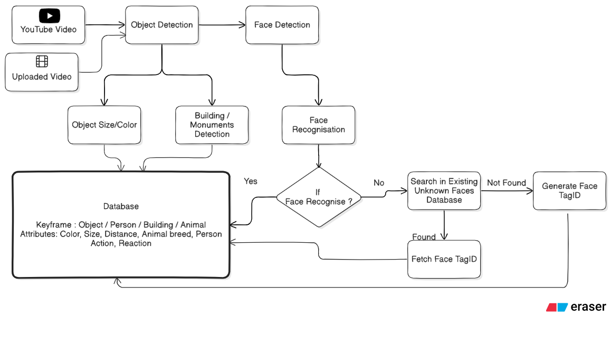

# 🎥 VISTA – Video Intelligence Search & Tagging Assistant


Face Detection • Face Recognition • Object Detection • Video Understanding

## Overview

VISTA is an intelligent video-processing system. This repository currently implements the object detection prototype with a simple web UI and a CLI pipeline. It:

- Downloads YouTube videos
- Extracts keyframes (1 frame/sec)
- Runs YOLOv8 object detection
- Saves annotated frames, a single JSON of detections, and a summary
- Renders an annotated video from processed frames

Future prototypes will add face detection (RetinaFace), face recognition (ArcFace/InsightFace), and embeddings (Face + CLIP).

## Processing Flow



## Project Phases

1) Prototype (Current)
- YouTube download (PyTube, with `yt-dlp` fallback)
- Frame extraction (OpenCV)
- YOLOv8 object detection (Ultralytics)
- Single JSON results per video
- Annotated frames and rendered output video
- Web UI (Flask) for easy processing

2) Full System (Later)
- Backend (FastAPI)
- Processing Engine (GPU workers)
- PostgreSQL + pgvector
- Vector search (FAISS/Milvus)
- React/Next.js frontend
- Full video search engine with face + CLIP embeddings

## Folder Structure

At runtime, data is written under a nested `vista-prototype/` directory inside the repo root to keep outputs contained.

```
/ (repo root)
├── pipeline/                 # modular pipeline (download, frames, detection, render)
├── web/                      # Flask web UI (HTML/CSS/JS + API)
├── implementation.py         # CLI entrypoint for the pipeline
├── README.md                 # this file
└── vista-prototype/          # runtime data (auto-created)
    ├── videos/               # downloaded YouTube MP4s
    ├── frames/               # extracted raw frames
    └── results/
        └── <video_id>/
            ├── processed_frames/       # annotated frames (YOLO)
            ├── detection_results.json  # all detections for the video
            ├── metadata.txt            # summary + device info
            └── detections_video.mp4    # rendered video (may fall back to .avi)
```

Notes
- `video_id` is derived from the YouTube URL (or sanitized filename). Existing per-video results will not be overwritten; delete the folder to re-run.
- The pipeline defaults to `yolov8n.pt` for speed. Ultralytics will download the model automatically.
- GPU is optional. If `torch` with CUDA is available, YOLO can run on GPU; otherwise CPU is used.

## Technologies Used

- Object Detection: YOLOv8 (Ultralytics)
- Frame Extraction: OpenCV
- Video Download: PyTube (fallback: `yt-dlp`)
- Web UI: Flask
- Optional: `tqdm` for progress bars, `torch` for GPU

## Prototype: Development Process

1) Download YouTube Video
- Highest-quality MP4 using PyTube; falls back to `yt-dlp` when PyTube fails.
- Saved into `vista-prototype/videos/`.

2) Extract Frames
- OpenCV; extracts 1 frame per second.
- Saved into `vista-prototype/frames/`.

3) Object Detection (YOLOv8)
- Runs on each frame; filters by confidence threshold.
- Annotated frames saved into `vista-prototype/results/<video_id>/processed_frames/`.
- Single JSON with all detections saved as `vista-prototype/results/<video_id>/detection_results.json`.

4) Metadata + Summary
- `metadata.txt` includes device, model, confidence threshold, counts per class.
- Total frames and detections reported via API/CLI.

5) Render Annotated Video
- Frames in `processed_frames/` are rendered to `detections_video.mp4` (fallback to `.avi` if MP4 writer is unavailable).

## Installation

Create a virtual environment and install dependencies.

Windows (PowerShell)
```
python -m venv env
.\env\Scripts\activate
pip install ultralytics opencv-python pytube flask tqdm yt-dlp pillow
```

macOS/Linux (bash)
```
python3 -m venv env
source env/bin/activate
pip install ultralytics opencv-python pytube flask tqdm yt-dlp pillow
```

Notes
- `yt-dlp` is optional but recommended; the pipeline uses it when PyTube cannot download.
- If you plan to use GPU, install a CUDA-enabled `torch` build.

## Running

CLI (process a video once)
```
python implementation.py --url "https://www.youtube.com/watch?v=VIDEO_ID" --conf-threshold 0.7 --fps 1
```
Or process a local file
```
python implementation.py --video "path/to/video.mp4" --conf-threshold 0.7 --fps 1
```
Outputs are written to `vista-prototype/results/<video_id>/`.

Web UI (interactive)
```
python web/app.py
```
- Open `http://localhost:8000/`
- Paste a YouTube URL, set confidence threshold and output FPS, then Process
- Links to the annotated video, detection JSON, and metadata are provided

API
- Endpoint: `POST /api/process`
- Body: `{ "url": string, "conf_threshold": float, "fps": int }`
- Returns: `video_id`, `summary`, and URLs to output files under `/results/<video_id>/...`

## Output Summary

- Total frames processed
- Total objects detected
- Counts per class
- Confidence threshold used

## Suggested Test Videos

- Busy Street Intersection — `2vjEKevuV4k`
- People Walking with Dogs — `iQZM1zO0Fdk`
- Cat Playing — `J---aiyznGQ`

## Later Expansion – Full System Architecture

Three separate projects will compose the full VISTA system:

- Frontend (React/Next.js): upload, search panel, view detections
- Backend (FastAPI): stores metadata, exposes search API, vector search integration
- Processing Engine (GPU workers): download, keyframes, YOLO, face (RetinaFace + ArcFace), CLIP indexing, push data to backend
- Vector Database (pgvector/Milvus): face + CLIP embeddings, text-to-video search

Future Features
- Multi-object tracking
- Person action recognition
- Animal breed classification
- Landmark/monument recognition
- Depth estimation (MiDaS)
- Full video search engine
- FaceTag identity system
- Admin panel for label correction
- Multi-language caption-based search

## Author

Prof. Nehal Patel — AI Researcher • Developer • Educator