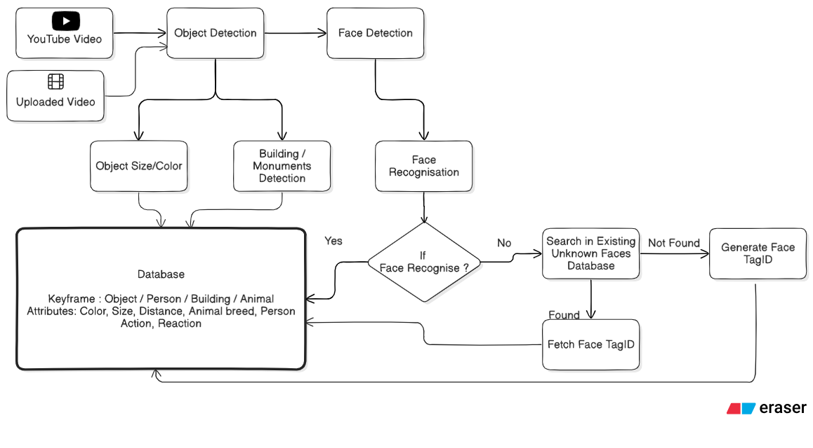

# 🎥 VISTA – Video Intelligence Search & Tagging Assistant


Face Detection • Face Recognition • Object Detection • Monument Classification • Video Understanding

## Overview

VISTA is an intelligent video-processing system. This repository implements the object detection prototype with optional face detection, monument classification, a simple web UI, and a CLI pipeline. It:

- Downloads YouTube videos
- Extracts keyframes (configurable, default 1 frame/sec)
- Runs YOLOv8 object detection (with optional per-object color)
- Runs optional InsightFace face detection + recognition (Buffalo L/S/SC) on frames
- Runs monument classification (default: **YOLOv8-cls**; legacy ResNet18 + logistic regression available)
- Saves annotated frames (objects + face boxes + monument labels), a single JSON of detections, and a summary
- Renders an annotated video from processed frames

**Note:** Uncertain face matches are no longer shown as `Maybe:` badges — only high-confidence identities appear as green labels; weaker matches are treated as Unknown.

## Processing Flow



## Project Phases

1) Prototype (Current)
- YouTube download (PyTube, with `yt-dlp` fallback)
- Frame extraction (OpenCV)
- YOLOv8 object detection (Ultralytics)
- Single JSON results per video
- Annotated frames and rendered output video
- Web UI (Flask) for easy processing

2) Full System (Later)
- Backend (FastAPI)
- Processing Engine (GPU workers)
- PostgreSQL + pgvector
- Vector search (FAISS/Milvus)
- React/Next.js frontend
- Full video search engine with face + CLIP embeddings

## Folder Structure

At runtime, data is written under a nested `vista-prototype/` directory inside the repo root to keep outputs contained.

```
/ (repo root)
├── pipeline/                 # modular pipeline (download, frames, detection, render)
├── web/                      # Flask web UI (HTML/CSS/JS + API)
├── scripts/                  # organize, build_models, curate, monument eval/train helpers
├── implementation.py        # CLI entrypoint for the pipeline
├── README.md                 # this file
├── experiments/              # local training runs (e.g. monument YOLO-cls; gitignored outputs)
└── vista-prototype/         # runtime data (auto-created)
    ├── videos/               # downloaded YouTube MP4s
    ├── frames/               # extracted raw frames
    ├── results/
    │   └── <video_id>/
    │       ├── processed_frames/       # annotated frames (YOLO + faces + monuments)
    │       ├── detection_results.json  # all detections for the video
    │       ├── metadata.txt            # summary + device info
    │       └── detections_video.mp4   # rendered video (may fall back to .avi)
    ├── training_data/        # datasets for face & monument training (see below)
    │   ├── monuments/        # folder-per-monument images
    │   ├── monument_policy.json  # optional excluded_classes list
    │   ├── monument_splits/  # train/val split for evaluation
    │   └── monument_eval/    # confusion matrices / FP audits (local)
    ├── known_faces/          # face_database.npy (mean embedding per person)
    └── monument_model/       # classifiers
        ├── meta.json / *.npy # legacy ResNet18 + LogisticRegression
        └── yolo_cls/best.pt  # default Ultralytics classify weights (when trained)
```

## Datasets and training

To **recognize faces** (e.g. celebrities) and **classify monuments** in videos, add training images and build the models.

### Where to put datasets

All paths below are under `vista-prototype/` (created at first run).

| Purpose | Folder | Layout |
|--------|--------|--------|
| **Face recognition** (final) | `vista-prototype/training_data/faces/<name>/` | One folder per person; put images of that person inside. |
| **Monument classification** (final) | `vista-prototype/training_data/monuments/<name>/` | One folder per monument; put images inside. |
| **Unorganized faces** | `vista-prototype/training_data/inbox_faces/<name>/` | One subfolder per person; run organize script to copy into `faces/`. |
| **Unorganized monuments** | `vista-prototype/training_data/inbox_monuments/<name>/` | One subfolder per monument; run organize script to copy into `monuments/`. |
| **Bulk datasets** (e.g. Kaggle) | `vista-prototype/training_data/datasets/faces/` and `.../datasets/monuments/` | Place downloaded datasets here; use `--from-datasets` when running the organize script. |

See `Dataset.md` for example Kaggle datasets (e.g. Indian cricketers, Indian monuments).

### Commands to run (from repo root)

**1. Organize images** (copy from inbox or from `datasets/` into `faces/` and `monuments/`):

```bash
# Preview what will be copied (dry run)
python scripts/organize_training_data.py --from-datasets --dry-run

# Organize from training_data/datasets/ into faces/ and monuments/
python scripts/organize_training_data.py --from-datasets

# Only faces
python scripts/organize_training_data.py --from-datasets --faces-only

# Only monuments
python scripts/organize_training_data.py --from-datasets --monuments-only

# Organize from inbox_faces/ and inbox_monuments/ (no --from-datasets)
python scripts/organize_training_data.py
```

**2. Build models** (face recognition + monument classifier):

```bash
# Build both face and monument models
python scripts/build_models.py

# Only face recognition (from training_data/faces/ → vista-prototype/known_faces/)
python scripts/build_models.py --faces-only

# Only legacy ResNet monument model (monuments/ + dataset/ → monument_model/)
python scripts/build_models.py --monuments-only

# Legacy monument training with rembg preprocess (optional extras)
pip install -r requirements-monuments-extra.txt
python scripts/build_models.py --monuments-only --full --monument-preprocess rembg

# Use GPU if available
python scripts/build_models.py --device cuda
```

**Preferred monument model (YOLOv8-cls)** — higher holdout accuracy and far fewer false positives on street/crowd frames than the legacy ResNet path:

```bash
# Train/eval using the persisted train/val split (creates experiments/monument_v2/...)
python scripts/train_monument_yolo_cls.py --epochs 20 --imgsz 224

# Copy best weights into the runtime path (script already points integration at):
#   vista-prototype/monument_model/yolo_cls/best.pt
# If needed after training:
#   copy experiments/monument_v2/yolo_cls/weights/best.pt → vista-prototype/monument_model/yolo_cls/best.pt
```

When `monument_model/yolo_cls/best.pt` exists, video processing uses **yolo_cls** by default. To force the legacy backend:

- Environment: `VISTA_MONUMENT_BACKEND=resnet`
- API body: `"monument_backend": "resnet"` (or `"yolo_cls"`)

**Evaluate / audit monuments:**

```bash
# Create or reuse stratified split, then write confusion matrix under monument_eval/
python scripts/evaluate_monument_classifier.py --create-split
python scripts/evaluate_monument_classifier.py --out-dir vista-prototype/training_data/monument_eval/baseline

# Street/crowd false-positive audit (legacy ResNet path)
python scripts/audit_monument_false_positives.py --frames-dir vista-prototype/frames/<video_id> --max-frames 30 --stride 5

# YOLO-cls false-positive audit
python scripts/audit_monument_fp_yolo.py --frames-dir vista-prototype/frames/<video_id> --weights vista-prototype/monument_model/yolo_cls/best.pt --max-frames 30 --stride 5
```

Exclude noisy multi-building classes via `vista-prototype/training_data/monument_policy.json` (`excluded_classes`).

**Inspect face database (mean vectors per person):**

```bash
python scripts/read_face_database.py
python scripts/read_face_database.py --json
```

**2.5 Clean monument dataset quality (strict, review-first):**

Use this before monument retraining when classes contain noisy images (wrong landmark, people-dominant, blurry).

```bash
# Scan only (no file moves); --scan is an alias for --mode scan
python scripts/curate_monuments.py --scan --class-name tajmahal
python scripts/curate_monuments.py --scan --no-people --rembg-check --urban-review-candidates

# Quarantine flagged files for manual review (no deletion)
python scripts/curate_monuments.py --mode quarantine --class-name tajmahal

# Run on all monument classes
python scripts/curate_monuments.py --mode quarantine

# Restore / purge after review
python scripts/curate_monuments.py --mode restore --class-name tajmahal
python scripts/curate_monuments.py --mode purge --yes
```

By default, flagged files are moved to `vista-prototype/training_data/monuments_quarantine/` and a JSON report is written under `vista-prototype/training_data/curation_reports/`.
Duplicate and near-duplicate images are also flagged (strict mode, per class) and moved to quarantine.

**Optional background-removal batch** (training hygiene; not a substitute for a good classifier):

```bash
pip install -r requirements-monuments-extra.txt
python scripts/remove_monument_backgrounds.py
# writes parallel tree under training_data/monuments_nobg/ by default
```

**3. Full reset and rebuild from scratch** (when faces are missing or labels changed):

```bash
# (PowerShell) Remove previous runtime/build outputs: models, cached features, frames, and past results
Remove-Item -Recurse -Force "vista-prototype/known_faces/*","vista-prototype/monument_model/*","vista-prototype/results/*","vista-prototype/frames/*","vista-prototype/detections/*","vista-prototype/face_results/*"

# Move new images from inbox to final training folders
python scripts/organize_training_data.py

# Clean model state + rebuild both face and monument models from scratch
python scripts/build_models.py --clean --full
```

Label normalization during model build:
- `John_Wick` is stored/displayed as `John Wick`
- `Taj_mahal` is stored/displayed as `Taj Mahal`

After building, process a video in the web UI or CLI; recognized faces and monuments will appear in the results. You can also upload images and train from the **Training** page in the web UI (`/training`).

### Notes
- `video_id` is derived from the YouTube URL (or sanitized filename). Existing per-video results will not be overwritten; delete the folder or use force rescan to re-run.
- The pipeline defaults to `yolov8n.pt` for objects. Ultralytics will download the model automatically.
- GPU: install CUDA-enabled `torch` for YOLO/PyTorch. For InsightFace GPU, install **`onnxruntime-gpu` only** (do not install both `onnxruntime` and `onnxruntime-gpu` — the CPU package can hide CUDA). Ensure CUDA 12.x bin is on `PATH` if CUDA EP fails to load.
- Monument recognition skips person-heavy frames and rejects low-confidence / ambiguous predictions (label `Unknown`).

## MongoDB (optional)

To persist detection results for a **separate search engine project** (e.g. query "Nehal in red car" and rank videos by face + object), set:

- **`MONGODB_URI`** (or `MONGO_URI`): connection string (e.g. `mongodb://localhost:27017` or Atlas SRV).
- **`VISTA_DB_NAME`** (optional): database name; default `vista_search`.

After each successful video run, the app writes to two collections:

- **`videos`**: one document per video (video_id, source_url, title, duration_sec, thumbnail, face_labels, object_labels, monument_labels, summary, run_stats).
- **`frames`**: one document per frame (video_id, frame_filename, frame_index, time_sec, objects, faces, monument).

Indexes are created for efficient search on `faces.label`, `objects.class`, `objects.color`, `objects.label`. If `MONGODB_URI` is not set, indexing is skipped and the app behaves as before (JSON and files only). See `MONGODB_SEARCH_ENGINE_PLAN.md` and `pipeline/mongodb_store.py` for the full schema.

## Technologies Used

- Object Detection: YOLOv8 (Ultralytics)
- Monument Classification: YOLOv8-cls (default); legacy ResNet18 + scikit-learn LogisticRegression
- Face Detection / Recognition: InsightFace (Buffalo L/S/SC; requires `insightface` + `onnxruntime-gpu` recommended)
- Frame Extraction: OpenCV
- Video Download: PyTube (fallback: `yt-dlp`)
- Web UI: Flask
- Optional: `pymongo` for MongoDB, `tqdm`, `torch` / CUDA, `rembg` (see `requirements-monuments-extra.txt`)

## Prototype: Development Process

1) Download YouTube Video
- Highest-quality MP4 using PyTube; falls back to `yt-dlp` when PyTube fails.
- Saved into `vista-prototype/videos/`.

2) Extract Frames
- OpenCV; extracts 1 frame per second.
- Saved into `vista-prototype/frames/`.

3) Object Detection (YOLOv8)
- Runs on each frame; filters by confidence threshold.
- Annotated frames saved into `vista-prototype/results/<video_id>/processed_frames/`.
- Single JSON with all detections saved as `vista-prototype/results/<video_id>/detection_results.json`.

4) Metadata + Summary
- `metadata.txt` includes device, model, confidence threshold, counts per class.
- Total frames and detections reported via API/CLI.

5) Render Annotated Video
- Frames in `processed_frames/` are rendered to `detections_video.mp4` (fallback to `.avi` if MP4 writer is unavailable).

## Installation

Create a virtual environment and install dependencies.

Windows (PowerShell)
```
python -m venv env
.\env\Scripts\activate
pip install -r requirements.txt
pip install ultralytics opencv-python pytube flask tqdm yt-dlp pillow
```

macOS/Linux (bash)
```
python3 -m venv env
source env/bin/activate
pip install -r requirements.txt
pip install ultralytics opencv-python pytube flask tqdm yt-dlp pillow
```

**Optional – face detection:** Install InsightFace and **one** ONNX runtime (prefer GPU):
```
pip uninstall -y onnxruntime onnxruntime-gpu
pip install insightface onnxruntime-gpu    # GPU (CUDA)
# or: pip install insightface onnxruntime  # CPU only
```
Optional monument extras (rembg cutouts / eval plots):
```
pip install -r requirements-monuments-extra.txt
```
- `yt-dlp` is optional but recommended; the pipeline uses it when PyTube cannot download.
- If you plan to use GPU for YOLO, install a CUDA-enabled `torch` build.

## Running

CLI (process a video once)
```
python implementation.py --url "https://www.youtube.com/watch?v=VIDEO_ID" --conf-threshold 0.7 --fps 1
```
Or process a local file
```
python implementation.py --video "path/to/video.mp4" --conf-threshold 0.7 --fps 1
```
Outputs are written to `vista-prototype/results/<video_id>/`.

Web UI (interactive)
```
python web/app.py
```
- Open `http://localhost:8000/`
- Paste a YouTube URL, set confidence threshold, face model (if using face detection), and output FPS, then Process
- Links to the annotated video, detection JSON, and metadata are provided
- Detected objects, faces, and monuments appear as clickable badges; click to view frames containing that class

API
- Endpoint: `POST /api/process`
- Body: `{ "url": string, "conf_threshold": float, "fps": int, "face_model": "buffalo_l" | "buffalo_s" | "buffalo_sc", "monument_backend": "yolo_cls" | "resnet", ... }`
- Returns: `video_id`, `summary` (including face and monument stats when enabled), and URLs to output files under `/results/<video_id>/...`

## Output Summary

- Total frames processed
- Total objects detected
- Total face detections (when InsightFace is installed and used)
- Monument labels when the classifier accepts a frame (Unknown otherwise)
- Counts per class
- Confidence threshold and models used

## Suggested Test Videos

- Busy Street Intersection — `2vjEKevuV4k`
- People Walking with Dogs — `iQZM1zO0Fdk`
- Cat Playing — `J---aiyznGQ`

## Later Expansion – Full System Architecture

Three separate projects will compose the full VISTA system:

- Frontend (React/Next.js): upload, search panel, view detections
- Backend (FastAPI): stores metadata, exposes search API, vector search integration
- Processing Engine (GPU workers): download, keyframes, YOLO, face (RetinaFace + ArcFace), CLIP indexing, push data to backend
- Vector Database (pgvector/Milvus): face + CLIP embeddings, text-to-video search

Future Features
- Multi-object tracking
- Person action recognition
- Animal breed classification
- Stronger landmark pipeline (detector → ROI → classify / retrieval)
- Depth estimation (MiDaS)
- Full video search engine
- FaceTag identity system
- Admin panel for label correction
- Multi-language caption-based search

## Author

Prof. Nehal Patel — AI Researcher • Developer • Educator